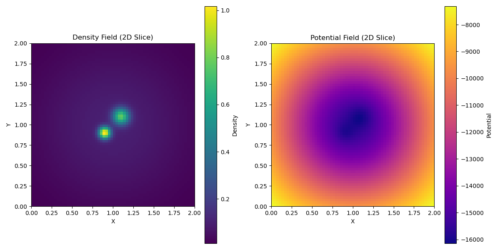

# Self-Gravity Solver

This project implements a self-gravity solver in C, likely using a tree-based method for calculating gravitational forces. It includes modules for handling gravitational calculations, grid operations, and tree structures. A Python script is provided for visualization of the results.

## Files:
- `gravity.c`, `gravity.h`: Core gravity calculation logic.
- `grid.c`, `grid.h`: Grid-related operations.
- `tree.c`, `tree.h`: Tree data structure implementation (e.g., for N-body simulations).
- `vector.h`: Vector utility functions.
- `main.c`: Main program entry point.
- `visualize.py`: Python script for visualizing results.
- `CMakeLists.txt`: CMake build configuration.

## Building the Project

This project uses CMake for its build system. To build the `gravity_solver` executable, follow these steps:

1. Create a build directory:
   ```bash
   mkdir build
   cd build
   ```

2. Run CMake to configure the project:
   ```bash
   cmake ..
   ```

3. Build the project:
   ```bash
   make
   ```

   This will create the `gravity_solver` executable in the `build/` directory.

## Running the Solver

After building, you can run the solver from the `build/` directory:

```bash
./gravity_solver
```

## Visualization

The `visualize.py` script can be used to visualize the output data (e.g., `potential.dat`, `density.dat`). Make sure you have the necessary Python libraries installed (e.g., `matplotlib`, `numpy`).

```bash
python ../visualize.py
```

## Sample Visualization

Here's a sample visualization of the density and potential fields:



---
**Disclaimer:** This repo has been entirely generated by Gemini.
